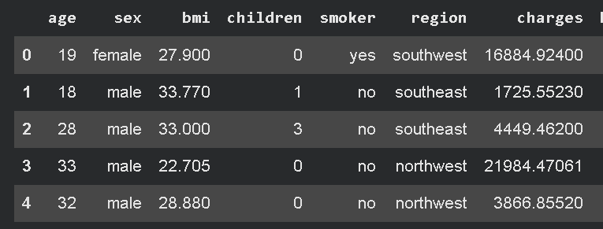
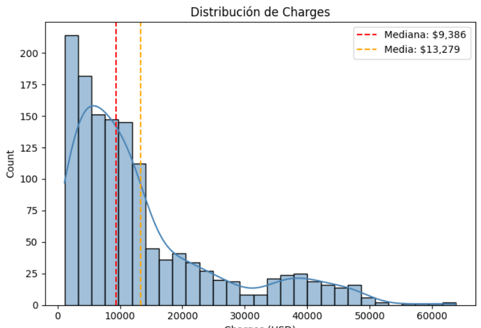
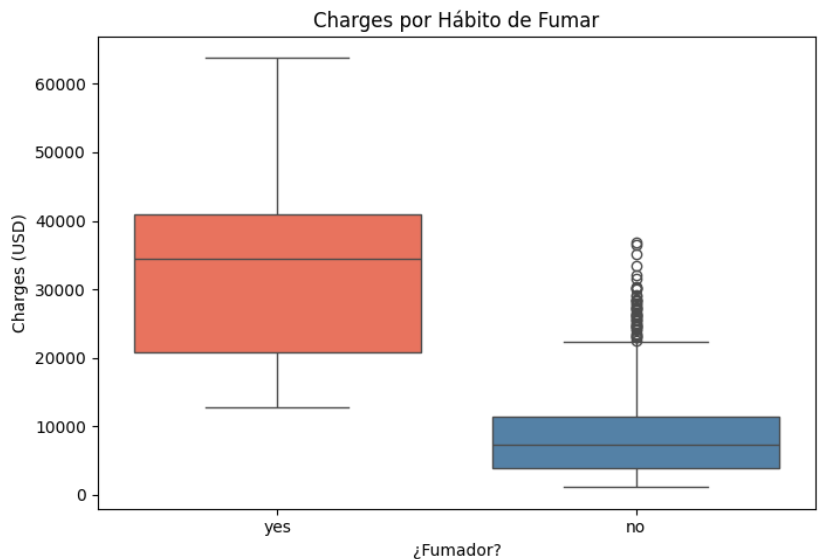
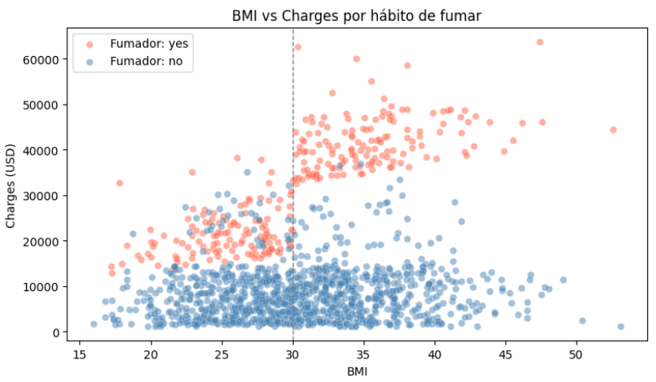
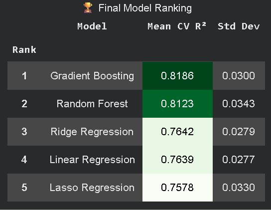

# 🏥 Medical Insurance Cost Prediction

> End-to-end Machine Learning project focused on predicting medical insurance costs using regression models, exploratory data analysis, preprocessing, and model evaluation.

---

## 📌 Project Overview

This project explores a healthcare insurance dataset to predict individual medical charges based on demographic and lifestyle features such as:

- Age
- BMI
- Smoking habits
- Number of children
- Sex
- Region

The workflow includes:

✅ Data Cleaning  
✅ Exploratory Data Analysis (EDA)  
✅ Feature Engineering  
✅ Data Preprocessing  
✅ Regression Modeling  
✅ Model Comparison  
✅ Performance Evaluation  

---

# 📊 Dataset Preview



---

# 🔍 Exploratory Data Analysis

The project includes multiple visualizations to better understand the dataset and identify relationships between variables.

## 📈 Charges Distribution



---

## 🚬 Impact of Smoking on Insurance Charges

One of the strongest findings in the dataset was the enormous difference in medical charges between smokers and non-smokers.



### 💡 Insight
Smokers tend to generate dramatically higher insurance costs compared to non-smokers, making `smoker` one of the most important predictive features.

---

## ⚖️ BMI vs Charges



### 💡 Insight
Higher BMI values generally correlate with higher medical charges, especially among smokers.

---


# ⚙️ Machine Learning Pipeline

The project uses Scikit-Learn pipelines and preprocessing techniques to prepare the data before training the models.

## 🧹 Preprocessing Steps

- Missing value handling
- One-Hot Encoding for categorical features
- Feature scaling using `StandardScaler`
- Train/Test Split
- Pipeline integration

---

# 🤖 Models Tested

Several regression algorithms were trained and compared.

| Model | Description |
|---|---|
| Linear Regression | Baseline regression model |
| Ridge Regression | Regularized linear model |
| Lasso Regression | Feature-selection oriented regression |
| Random Forest Regressor | Ensemble tree-based model |
| Gradient Boosting Regressor | Boosting ensemble model |

---

# 📊 Model Performance



Example evaluation metrics used:

- MAE (Mean Absolute Error)
- MSE (Mean Squared Error)
- RMSE (Root Mean Squared Error)
- R² Score

---

# 🧠 Key Insights

## 🚬 Smoking is the dominant factor
Smoking status had the highest impact on insurance costs across the entire dataset.

## 📈 BMI and age matter significantly
Older individuals and people with higher BMI values generally showed higher insurance expenses.

## 🌍 Region had limited impact
Compared to smoking and BMI, geographic region contributed much less to prediction performance.

## 🌲 Ensemble models performed best
Tree-based ensemble models achieved the strongest predictive performance.

---

# 🛠️ Tech Stack

## 📚 Libraries & Tools

- Python 🐍
- Pandas
- NumPy
- Matplotlib
- Seaborn
- Scikit-Learn
- Jupyter Notebook

---

# 📂 Project Structure

```bash
medical-insurance-cost-prediction/
│
├── data/
│   └── insurance.csv
│
├── images/
│   ├── charges_distribution.png
│   ├── smoker_vs_charges.png
│   ├── bmi_vs_charges.png
│   ├── correlation_heatmap.png
│   └── model_comparison.png
│
├── notebooks/
│   └── Proyecto 2.ipynb
│
├── README.md
│
└── requirements.txt
```

---

# 🚀 How to Run

## 1️⃣ Clone the repository

```bash
git clone https://github.com/your-username/medical-insurance-cost-prediction.git
```

## 2️⃣ Install dependencies

```bash
pip install -r requirements.txt
```

## 3️⃣ Open the notebook

```bash
jupyter notebook
```


---

# 👨‍💻 Author
Rubén Cuello, Data Scientist
Developed as part of a Machine Learning & Data Science portfolio project.

---

# ⭐ If you found this project useful, consider giving it a star!